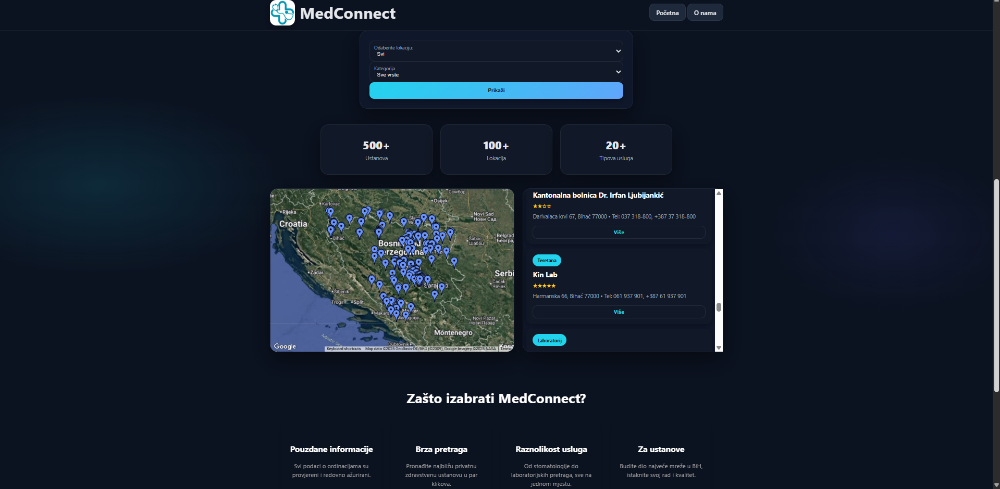

<h1 style="color:#2E86C1; font-size:48px;">MedConnect</h1>

MedConnect is a web application designed to help patients easily find and connect with healthcare providers, clinics, and pharmacies. Through an interactive map and intuitive interface, users can:

<ul style="font-size:16px; color:#34495E;">
  <li>View healthcare facilities on a Google Map</li>
  <li>Filter and search clinics or pharmacies by service type</li>
  <li>Access key details such as address, contact info, and working hours</li>
  <li>Quickly navigate to the desired location</li>
</ul>

The goal of this project is to digitize and modernize access to healthcare services.

<h2 style="color:#27AE60; font-size:36px;">Technologies</h2>
<ul style="font-size:16px; color:#34495E;">
  <li>Frontend: HTML, CSS, JavaScript</li>
  <li>Google Maps API for mapping and location data</li>
  <li>Node.js and etc.</li>
</ul>

<h2 style="color:#27AE60; font-size:36px;">Project Status</h2>

This project is currently in development. Contributions, suggestions, and bug reports are welcome.

